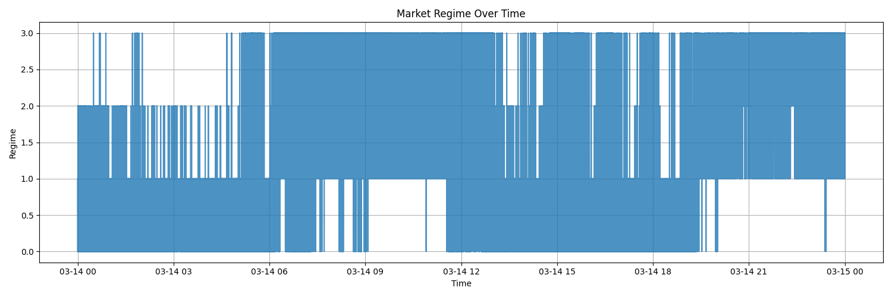

<p align="center">
  
</p>

# 🧠 Regime Detection in Market Microstructure Data


---

## 📚 Table of Contents
- [📝 Problem Statement](#-problem-statement)
- [📘 Final Report](#-final-report)
- [🧠 What is Regime Detection?](#-what-is-regime-detection)
- [🔧 Features Engineered](#-features-engineered)
- [🤖 Clustering and Output](#-clustering-and-output)
- [📊 Results Snapshot](#-results-snapshot)
- [📁 Folder Structure](#-folder-structure)
- [🛠️ How to Run the Project](#-how-to-run-the-project)
- [🧰 Tech Stack](#-tech-stack)
- [✅ Project Milestones](#-project-milestones)
- [🙋 About the Author](#-about-the-author)

---

## 📝 Problem Statement

This project is based on a real-world task provided by a company.  
The objective is to analyze high-frequency order book and trade data, engineer meaningful features, and apply **unsupervised learning** to detect **market regimes**.

📄 **Task Document by @RozReturns**  
🔗 [View the official task description](https://docs.google.com/document/d/1SXLmYQtJEIFHq3ULb2Qejl5in0U9ZwQBFQdXD6RqpX8/edit?tab=t.0)

📦 **Dataset**  
🔗 [Access the Dataset (Google Drive)](https://drive.google.com/drive/folders/1gFLwPLTE0nUN-MHoOn5u_1yrlbpI3Fst?usp=sharing)

---

## 📘 Final Report  

**Authored by:** Vaibhav Raj  
📝 [Read the Final Report](https://docs.google.com/document/d/1qLmr22UbpWiM6WHchLKa2RddSxvw8RUZu5mbb1eTDKk/edit?usp=sharing)

---

## 🧠 What is Regime Detection?

In financial markets, a **regime** refers to a specific state or behavior of the market, such as:

- Calm vs. Volatile periods  
- Buy-Dominant vs. Sell-Dominant activity  
- Stable vs. Highly Fluctuating Prices  

We detect such regimes using **KMeans clustering** over a set of carefully engineered features extracted from order book and trade data.

---

## 🔧 Features Engineered

We computed several key features from order book (`depth20`) and trade (`aggTrade`) data:

- 📉 **Spread**: Best ask - best bid  
- ⚖️ **Imbalance**: Buy vs. sell pressure  
- 🧮 **Microprice**: Weighted average of best bid and ask  
- 📊 **Volatility**: Price fluctuation over rolling windows  
- 🔁 **Volume Imbalance**: Buy vs. sell volume over time  

---

## 🤖 Clustering and Output

We used **KMeans clustering** to classify each timestamp into one of multiple market regimes based on the above features.

### 📂 Key Outputs:

- 📈 `regime_timeline.png`: Visualizes regime shifts over time  
  <p align="center">
    
  </p>

- 📄 `merged_with_regimes.csv`: Feature-rich dataset with regime labels  
  - 📍 `outputs/clusters/merged_with_regimes.csv`

- 📄 `regime_summary.csv`: Feature-wise averages for each regime  
  - 📍 `outputs/clusters/regime_summary.csv`

---

## 📊 Results Snapshot

| Regime | Avg Spread | Avg Imbalance | Avg Volatility |
|--------|------------|----------------|----------------|
|   0    |   0.23     |     -0.12      |    0.0045      |
|   1    |   0.17     |      0.08      |    0.0023      |
|   2    |   0.12     |     -0.05      |    0.0017      |

*(Sample metrics for demonstration)*

---

## 📁 Folder Structure

```bash
regime-detection/
├── data/
│   ├── aggTrade/
│   └── depth20_1000ms/
├── outputs/
│   ├── clusters/
│   │   ├── merged_with_regimes.csv
│   │   └── regime_summary.csv
│   └── plots/
│       └── regime_timeline.png
├── src/
│   ├── load_data.py
│   ├── feature_engineering.py
│   ├── clustering.py
│   └── visualization.py
├── main.py
├── regime_analysis.py
├── requirements.txt
└── README.md
```
--
## 🛠️ How to Run the Project

1. **Install the required Python packages**
   ```bash
   pip install -r requirements.txt

2.Run the main script
     
     python main.py
     python regime_analysis.py


3.Check the outputs/ folder for results:

- 📁 Clustered CSVs: outputs/clusters/
- 🖼️ Regime timeline plot: outputs/plots/

---

## ✅ Project Milestones
-  Load & preprocess order book and trade data
-  Engineer key features like spread, imbalance, and volatility
-  Apply clustering to detect market regimes
-  Visualize timeline of market behavior shifts
-  Generate a full report and summaries

---

## 🙋 About the Author
- Vaibhav Raj
- A Computer Science student with a passion for quantitative analysis, trading systems, and AI.
- [Visit my Portfolio](https://vaibhavrajportfolio.vercel.app)
- [🔗 LinkedIn](https://www.linkedin.com/in/vaibhav-raj-08794b270/)
